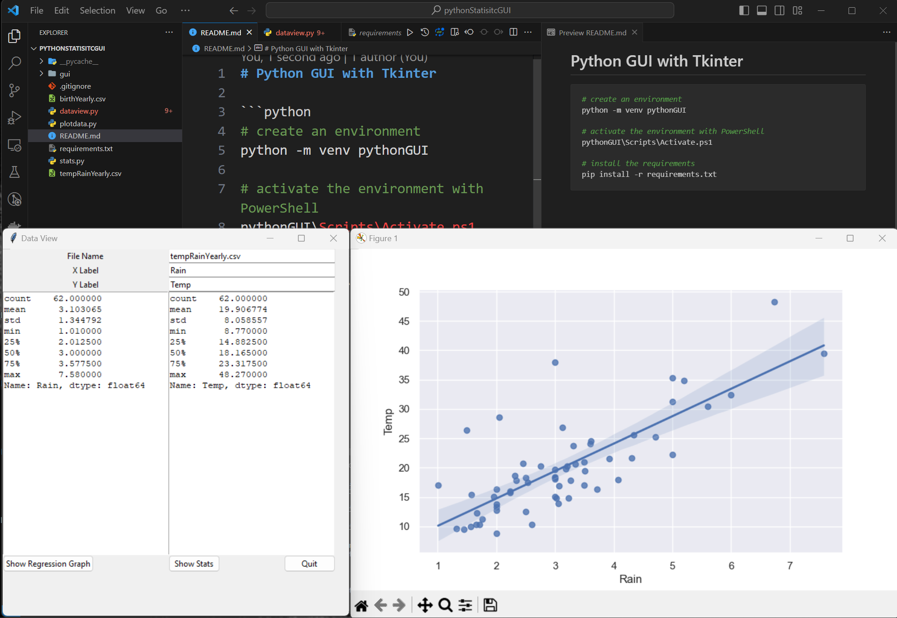

# Python GUI with Tkinter

```python
# create an environment
python -m venv pythonGUI

# activate the environment with PowerShell
pythonGUI\Scripts\Activate.ps1

# install the requirements
pip install -r requirements.txt
```
  
Python GUI Tkinter project in action:

